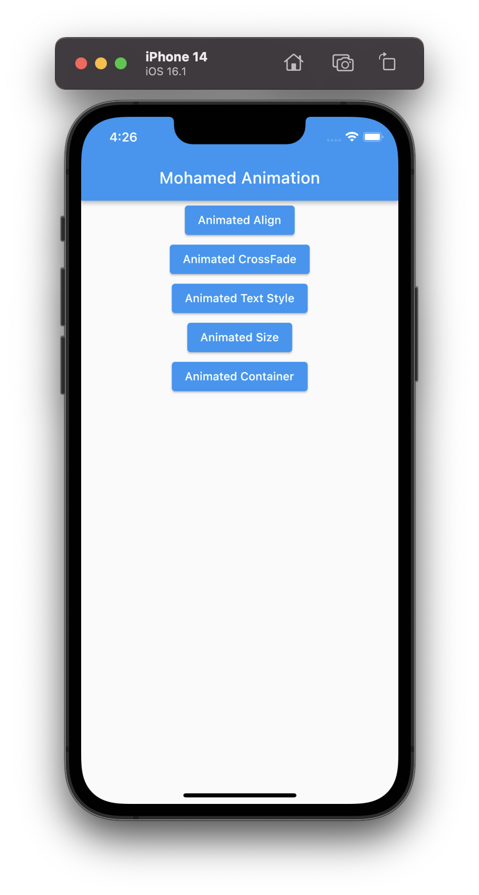

# flutter_animation_demo

                               

<video width="320" height="240" controls>
  <source src="movie.mp4" type="demo/2.mov">
  Your browser does not support the video tag.
</video>

